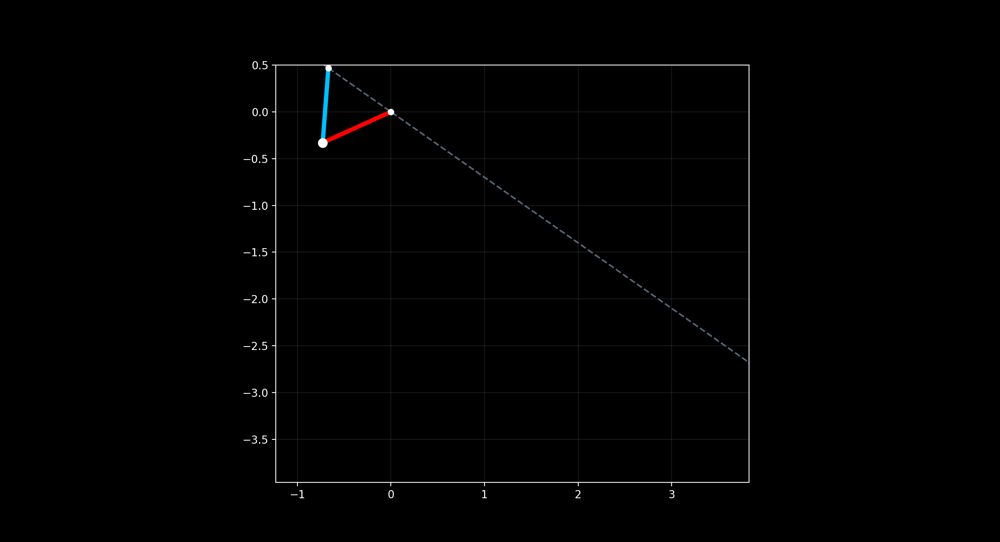

# Passive Brachiator: Underactuated Inverted-Compass Locomotion

<p align="center">
  
</p>

<p align="center">
    
    
</p>

---

## 🧐 About the Project
The **Passive Brachiator** is an open-source simulation environment and physics engine for studying **Underactuated Brachiation**. Inspired by the McGeer Passive Dynamic Walker, this project implements an "Inverted Compass" model that swings across a ceiling using nothing but gravity and inertia.

<p align="center">
  
</p>

### 🗝️ Key Characteristics
- **Purely Underactuated**: Zero motor torque; locomotion is a natural results of the system's orbital stability.
- **Limit-Cycle Gaits**: Discovery of stable "fixed points" where energy lost at impact equals energy gained from the slope.
- **Numerical Robustness**: Implementation of momentum-conserving grab transitions for stable stride sequences.

---

## 📑 Table of Contents
- [Installation](#-installation)
- [Usage](#-usage)
- [Project Structure](#-project-structure)
- [Mathematical Formulation](#-mathematical-formulation)
- [Authors](#️-authors)

---

## 🚀 Installation

### Prerequisites
- Python 3.8 or higher
- `pip` package manager

### Setup
```bash
git clone https://github.com/NK2511/Passive-Brachiator.git
cd Passive-Brachiator
pip install numpy matplotlib joblib
```

---

## 🎮 Usage

### 1. Generating Steady-State Data
Perform a parallelized sweep to find stable strides ($d^*$) for various incline angles:
```bash
python find_fixed_stride.py
```
*Note: This generates a `fixed_strides.csv` file used by the plotting tools.*

### 2. Running Simulations & Animations
Generate the live animation overlay with coordinate-space angle tracking and the phase portrait:
```bash
python passive_brachiator.py
```
*Tip: Now includes an interactive prompt to skip the live animation if only analysis is needed.*

### 3. Analyzing Stability & Slopes
Visualize how the robot converges from perturbations and its sensitivity to ceiling angles:
```bash
python plot_convergence.py
python plot_slope_sensitivity.py
```

---

## 📂 Project Structure
Following a recent refactoring, the project uses a flat, high-performance root structure for easier local development:

```text
├── passive_brachiator.py # Main Animation & Interactive Visualizer
├── stride_function.py    # RK4 Integrator & Impact Maps (Core)
├── find_fixed_stride.py  # Limit-Cycle Search Algorithm (Parallelized)
├── plot_convergence.py   # Stride-to-Stride Stability Analysis 
├── plot_slope_sensitivity.py # Parametric Sweep Plotter (requires fixed_strides.csv)
├── fixed_strides.csv     # Pre-calculated Steady-State Data (generated by find_fixed_stride.py)
```

---

## 📄 License
This project is licensed under the MIT License - see the LICENSE file for details.

## 📄 Citation

